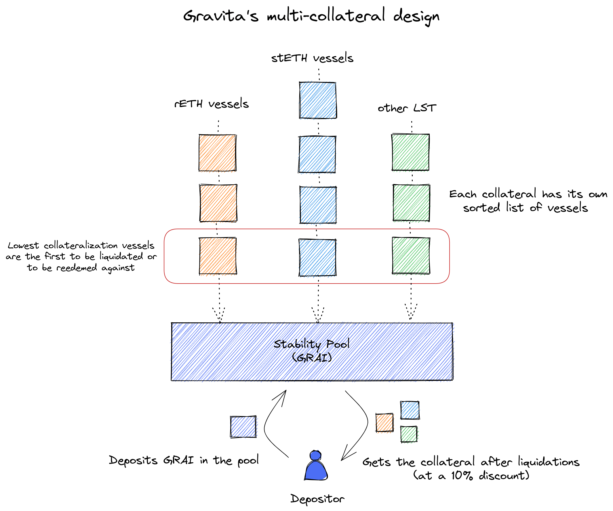
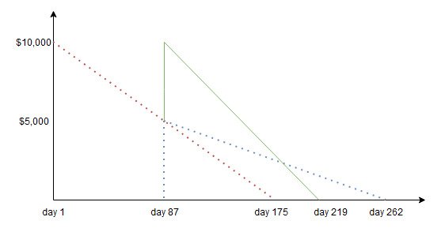

# Gravita: Decentralized Borrowing Protocol

Gravita is a decentralized protocol that allows Ether or liquid staking derivatives (LSDs) holders to obtain maximum liquidity against
their collateral without paying interest. 

## Table of Content <!-- omit in toc -->
- [Gravita: Decentralized Borrowing Protocol](#gravita-decentralized-borrowing-protocol)
  - [Overview](#overview)
  - [Core System Architecture](#core-system-architecture)
    - [Core Smart Contracts](#core-smart-contracts)
    - [Data and Value Silo Contracts](#data-and-value-silo-contracts)
  - [Smart Contract changes from Vesta](#smart-contract-changes-from-vesta)
  - [Fee Model](#fee-model)
  - [Development](#development)
    - [Clone \& Install](#clone--install)
    - [Deploy to a local node](#deploy-to-a-local-node)
  - [Running Tests](#running-tests)
    - [Hardhat](#hardhat)

***

## Overview

Gravita is based on [Liquity](https://github.com/liquity/dev), which introduced a fully decentralized borrowing protocol for eth. It is suggested to start from there to understand the underlying mechanisms of the protocol. 

Liquity had many forks, which expanded on the original design (e.g. allowing multiple ERC-20 tokens as collateral).
Gravita took inspiration from two in particular:
- [Vesta](https://github.com/vesta-finance/vesta-protocol-v1/releases/tag/v1.0) is multi-collateral. Each position can have only one collateral type and it is linked to a specific stability pool. Gravita is a fork of Vesta v1.0. 
- [Yeti](https://techdocs.yeti.finance/about-yeti-finance/contracts) allows cross-collateral positions, linked to a single stability pool

Gravita's debt token is called GRAI, while the governance token (not deployed on launch) GRVT.

Gravita has an unique multi-collateral design in which each position has a single collateral type, but they are all linked to the same stability pool:



***
## Core System Architecture

The core Liquity system consists of several smart contracts, which are deployable to the Ethereum blockchain.

All application logic and data is contained in these contracts - there is no need for a separate database or back end logic running on a web server. In effect, the Ethereum network is itself the Gravita back end. As such, all balances and contract data are public.

The three main contracts - `BorrowerOperations.sol`, `VesselManager.sol` and `StabilityPool.sol` - hold the user-facing public functions, and contain most of the internal system logic. Together they control Vessel state updates and movements of collateral and debt tokens around the system.

`AdminContract.sol` holds all the admin related functions, like adding a new collateral or modifying its parameters. Such governance - compared to Liquity's fully decentralized model - is needed as the LSD ecosystem is still changing.

### Core Smart Contracts

`AdminContract.sol` - contains all the functions to create a new collateral or modify its parameters. It is called by the other contracts to check if a collateral is valid and what are their parameters.

`BorrowerOperations.sol` - contains the basic operations by which borrowers interact with their Vessel: Vessel creation, collateral top-up / withdrawal, debt token issuance and repayment. It also sends issuance fees to the `FeeCollector` contract. BorrowerOperations functions call in to VesselManager, telling it to update Vessel state, where necessary. BorrowerOperations functions also call in to the various Pools, telling them to move tokens between Pools or between Pool <> user, where necessary.

`VesselManager.sol` and `VesselManagerOperations.sol` - contain functionality for liquidations and redemptions. They send redemption fees to the `FeeCollector` contract. Also contain the state of each Vessel - i.e. a record of the Vessel’s collateral and debt. VesselManager does not hold value (i.e. tokens). VesselManager functions call in to the various Pools to tell them to move tokens between Pools, where necessary.

`GravitaBase.sol` - Both VesselManager and BorrowerOperations inherit from this parent contract, which contains some common functions.

`StabilityPool.sol` - contains functionality for Stability Pool operations: making deposits, and withdrawing compounded deposits and accumulated collateral and GRVT gains. Holds the debt token Stability Pool deposits, and the collateral gains for depositors, from liquidations.

`DebtToken.sol` - the debt token contract, which implements the ERC20 fungible token standard in conjunction with EIP-2612 and a mechanism that blocks (accidental) transfers to addresses like the StabilityPool and address(0) that are not supposed to receive funds through direct transfers. The contract mints, burns and transfers tokens.

`SortedVessels.sol` - a doubly linked list that stores addresses of Vessel owners, sorted by their individual collateralization ratio (ICR). It inserts and re-inserts Vessels at the correct position, based on their ICR.

`PriceFeed.sol` - Contains functionality for obtaining the current collateral:USD price, which the system uses for calculating collateralization ratios.

### Data and Value Silo Contracts

Along with `StabilityPool.sol`, these contracts hold collateral and/or tokens for their respective parts of the system, and contain minimal logic:

`ActivePool.sol` - holds the total balance for each collateral and records the total debt of the active Vessels.

`DefaultPool.sol` - holds the total balance for each collateral and records the total debt of the liquidated Vessels that are pending redistribution to active Vessels. If a Vessel has pending collateral/debt “rewards” in the DefaultPool, then they will be applied to the Vessel when it next undergoes a borrower operation, a redemption, or a liquidation.

`CollSurplusPool.sol` - holds the collateral surplus from Vessels that have been fully redeemed from as well as from Vessels with an ICR > MCR that were liquidated in Recovery Mode. Sends the surplus back to the owning borrower, when told to do so by `BorrowerOperations.sol`.

`GasPool.sol` - holds the total debt token liquidation reserves. Debt tokens are moved into the `GasPool` when a Vessel is opened, and moved out when a Vessel is liquidated or closed.

## Smart Contract changes from Vesta

The general changes in the design are the following:
- Single Stability Pool (StabilityPoolManager was removed)
- No pure ETH allowed in the system, only ERC20 tokens
- Each collateral has an individual mintcap
- Added timelock for system changes
- Removed checkContract() as the addresses will be set on deployment. Some will still be upgradable.
- Redemptions are 0.97 to 1 (the reedemer pays a 3% fee to the borrower)
- Troves are named Vessels instead

`ActivePool` - no major changes

`AdminContract` - major rewrite (removed VestaParameters, the collaterals are added and managed from there)

`BorrowerOperations` - major refactoring

`CollSurplusPool` - no major changes

`DebtToken` - added whitelisted burn and mint.

`DefaultPool` - no major changes

`FeeCollector` - new contract, see [Fee Model](#fee-model)

`GasPool` - no changes

`GravitaBase` - no changes

`GravitaMath` - no changes

`PoolBase` - added from Yeti's implementation, to manage multiple collaterals on the StabilityPool

`PriceFeed` - major rewrite to add and update the price feed of all collateral types

`SortedVessels` - no changes

`StabilityPool` - heavy refactoring to have only one StabilityPool linked to all the sorted troves

`Timelock` - new contract

`VesselManager` - heavy refactoring

`VesselManagerOperations` - heavy refactoring. HintHelpers was added here


***

## Fee Model

Users interact with the system through the `BorrowerOperations` contract. There are three basic actions they can perform: 

1) the `openVessel()` method allows them to borrow debt tokens by depositing eligible assets as collateral; 
2) then they can either increase their debt position (by borrowing more debt tokens, which may or may not require more deposited collateral) or decrease their debt by repaying debt tokens - both actions are performed by the `adjustVessel()` method;
3) Finally, they can call `closeVessel()` by repaying the debt in full, which will end their loan.

This contract will mint both the required debt tokens requested by the user and the borrowing fee, and will transfer this fee to `FeeCollector.sol`, calling its `increaseDebt()` and `decreaseDebt()` methods accordingly.

The business rules for the `FeeCollector` contract are as follows:

* a standard 0,5% borrowing fee is charged upfront on each new debt (or debt increase): if Alice borrows $200,000 debt tokens, a $1,000 fee is sent to the fee contract (`increaseDebt(alice, 1000)`), and Alice now owes the platform $201,000
* the fee is refunded if the user repays his debt before the expiry of six months (~182 days), pro rata for the time elapsed, but the minimum fee corresponds to one week of interest
* the contract controls this decaying refund by immediately remitting the minimum fee (either to the Treasury or to a staking contract) and maintaining a record that includes (a) the refund balance (`amount`) (b) the timestamp of the last change in the amount (`from`) (c) the timestamp of expiry date (`to`): in Alice's case, on day 1, the platform collects 1/26 (one week out of 26) of $1,000, or about $38, and creates a record for her credit of $962, which decays/expires from day 7 to day 182
* if Alice repays her debt within days 1 through 7, the platform retains the minimum fee and reimburses her for the outstanding balance; if she repays within days 8 through 182, the reimbursement is prorated; after that, she is no longer entitled to reimbursement
* each time the methods `increaseDebt()` and `decreaseDebt()` are called, the prorated expired balance is collected by the platform; refunds that have been expired without repayment or expired pro rata fees during the term of the loan may also be collected, but are controlled off-chain

Special cases:

* if you make an additional loan before the original refund has expired, all control variables are changed; the new `from` becomes the current timestamp; the new `amount` is the unexpired portion of the previous balance plus the newly added fee; the new `to` is calculated based on the weight of the addition compared to the original balance and its remaining expiration time
* no changes are made to the `from` (starting point for expiration) if additions are made within the first week of lending
* the following diagram describes the behaviour: A refund of $10,000 falls linearly to $0 by day 175 (red line); halfway through (the remaining balance is now $5,000), the user acquires a new debt that entitles him to a new refund of $5,000, from day 87 to day 262 (blue line); the combined result is a refund of $10,000 that falls off faster (green line), based on the weight of that addition against the remaining balance/time.



***

## Development

Gravita is based on Yarn's [workspaces](https://classic.yarnpkg.com/en/docs/workspaces/) feature. You might be able to install some of the packages individually with npm, but to make all interdependent packages see each other, you'll need to use Yarn.

### Clone & Install

```
git clone https://github.com/Gravity-Finance/Gravity-protocol.git Gravita
cd Gravita
yarn
```

### Deploy to a local node
Add the `secret.js` file based on `secret.js.template` in case you don't have it set already.

Run:
```
yarn hardhat node
```

and on a second terminal:
```
yarn deploy-local
```

***

## Running Tests

### Hardhat

```
# install dependencies
yarn install

# copy secrets file
cp secrets.env.template secrets.env

# edit secrets.env (only GOERLI_DEPLOYER_PRIVATEKEY is required)

# run tests 
yarn test 

```